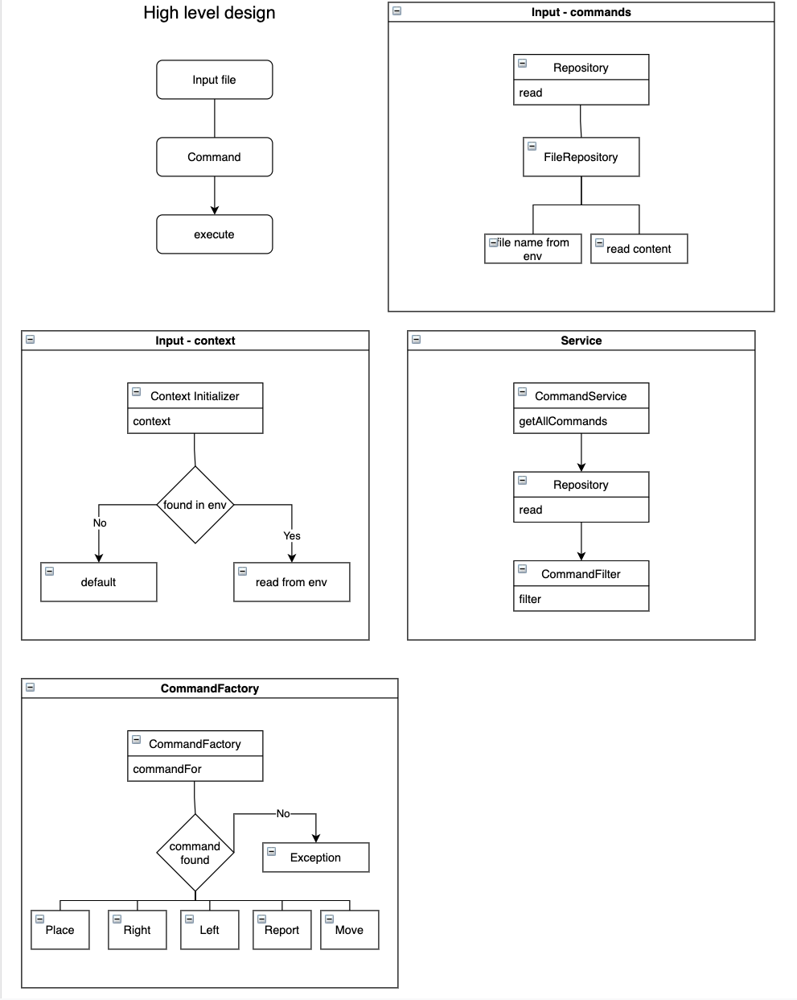
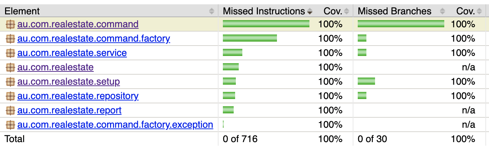

# Toy robot simulator

## Prerequisite

maven 3.6.2 Jdk 14

## Design thoughts
* In high level the application is designed by splitting it to read input and process/execute the commands and displaying output.
* Input is read from a repository which is flexible enough to extend it to read input from any other sources.
* Read input is filtered in service where the command list is filtered to have only valid commands to execute.
* Retrieved list of commands from service is parsed by command factory to produce relevant command, which is executed .
* Command factory is also extensible to add new commands, each command encapsulates its own behaviourI
* Input file for commands, and the board size are configurable through environment variables.
* Exception are thrown from different layers, which are handled in App level to display relevant error message.

 is available as `Design.drawio` which can be opened in https://app.diagrams.net/ using "Open Existing Diagram" option in landing page

### Code coverage

Entity objects are excluded from the report.

---
## How to use?

### Run Application
if maven and java14 are available in machine
<blockquote>
mvn compile exec:java -Dexec.mainClass="au.com.realestate.App"
</blockquote>
otherwise (using docker)  
<blockquote>
docker run -v "$PWD:/home" -w /home -it maven:3.6.3-adoptopenjdk-14 bash  

mvn compile exec:java -Dexec.mainClass="au.com.realestate.App"
</blockquote>

#### Customize input

By default, it uses input files from test resources, it can be overridden by environment variables
1. Board size - default 10 x 10
2. Input file - src/test/resources/input.txt  
   Variable names
   * `X` for x-axis e.g. `export X=5`  
   * `Y` for y-axis e.g. `export Y=5`  
   * `INPUT_FILE` for file location with path and name e.g `export INPUT_FILE=/home/sample.txt`  
_Note_: if `Y` is not provided it will use `X` value to create square board size 
     clear environment variable at any time

<blockquote>
unset X
unset Y
unset INPUT_FILE
</blockquote>

##### Run application
if maven and java14 are available in machine  
Input file can be mentioned using absolute path(`/Users/xxx/yyy.txt`)     
<blockquote>
export X=5 && export INPUT_FILE=/Users/xxx/yyy.txt && mvn compile exec:java -Dexec.mainClass="au.com.realestate.App"
</blockquote>

otherwise (using docker)  
current working directory is mounted as `/home`, probably easy way to give custom input file is copying into source code location and path can be provided as `-DINPUT_FILE=/home/yyy.txt` 

<blockquote>
docker run -v "$PWD:/home" -w /home -it maven:3.6.3-adoptopenjdk-14 bash  

export X=5 && export INPUT_FILE=/home/yyy.txt mvn compile exec:java -Dexec.mainClass="au.com.realestate.App" -DX=5 -DINPUT_FILE=/home/yyy.txt
</blockquote>

### Run test
<blockquote>
mvn clean verify
</blockquote>

#### Coverage report
Code coverage report is available in
<blockquote>
target/site/jacoco/index.html
</blockquote>

---

## Quality

### Findbugs

`mvn findbugs:gui`

### checkstyle

`mvn checkstyle::check`

### pmd

`mvn pmd::pmd`

---

### Practices

Had pre-commit git hook which run `mvn clean verify` before pushing so every push ensure better quality code   
Used `jacoco` code coverage tool to fail build when code coverage is compromised
